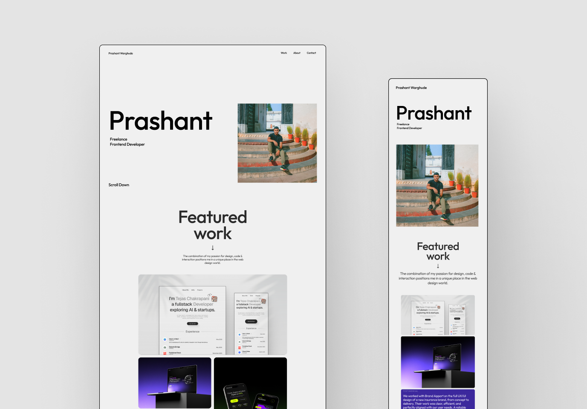

# Prashant's Portfolio

A minimal yet deeply animated portfolio — built with **React** and powered by **GSAP** for smooth, cinematic transitions.  
Every interaction and movement is designed to feel deliberate, natural, and fluid.

---

## Preview

---

## Overview

This project is my **personal portfolio**, crafted to reflect my taste for clean design and motion.  
While the layout stays minimal, the motion architecture is complex — using **timeline-based GSAP animations**, **component-level transitions**, and **scroll-triggered effects** to bring the interface alive.

---

## Tech Stack

- **React.js**
- **GSAP (GreenSock Animation Platform)**
- **CSS Modules / Tailwind**
- **Vite**

---

## Key Highlights

- **Scroll-based animations** using GSAP ScrollTrigger
- **Section reveal** and parallax effects
- **Performance-optimized timelines** for smoother transitions
- **Custom easing & stagger effects** for natural movement
- **Modular component structure** for scalable animation control

---

## Project Status

> **Currently in Progress**  
> Core structure and animation systems are in place.  
> Upcoming additions:

- Responsive layout tuning
- Contact section
- Mobile motion optimization
- Portfolio project cards with hover effects
- Footer

## Contact

If you’d like to connect or discuss a project, reach me here:

- **Twitter:** [@prashant_kvian](https://x.com/prashant_kvian)
- **Email:** prashant1warghude@gmail.com
